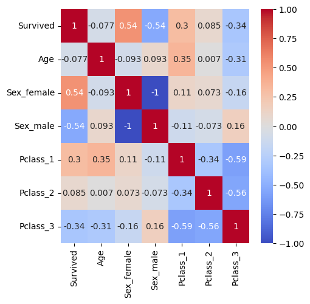

# Titanic Survival Model

### Basic Information

* **Person or organization developing model**: Benjamin Cooper, `benjamincooper@gwu.edu`, Matthew Wolf '`benjamincooper@gwu.edu`'  Gaurav Sethi `gsethi@gwu.edu`, Viviana Maria Rivera Bali `vrivera@gwu.edu`
* **Model date**: November, 2024
* **Model version**: 1.0
* **License**: MIT
* **Model implementation code**: [Titanic_Logistic_Regression_DNSC_3288.ipynb](https://github.com/benc423/DNSC3288Project/blob/main/Titanic_Logistic_Regression_DNSC_3288.ipynbhttps://github.com/benc423/DNSC3288Project/blob/main/Titanic_Logistic_Regression_DNSC_3288.ipynb)

### Intended Use (Ask about this)
* **Primary intended uses**: Predict who would survive in a sinking ship simmilar to the titanic, ideally under the same conditions.
* **Primary intended users**: Students exploring titanic dataset.
* **Out-of-scope use cases**: Any use beyond an educational example is out-of-scope.

### Training Data

* Data dictionary: 

| Name | Modeling Role | Measurement Level| Description|
| ---- | ------------- | ---------------- | ---------- |
|**PassengerId**| ID | int | unique row indentifier |
| **Survived** | target | binary | 1 = Survived, 0 = Perished |
| **Pclass** | input | int | 1 = first, 2 = second, 3 = third |
| **Name** | demographic information | str | name of passenger |
| **Sex** | demographic information | str | male = male, female = female |
| **Age** | demographic information | float | age of passenger in years |
| **SibSp** | demographic information | int | number of siblings/spouses aboard the Titanic |
| **Parch** | demographic information | int | number of parents/children aboard the Titanic |
| **Ticket** | inputs | str | Ticket Number |
| **Fare** | inputs | float | Amount paid for ticket |
| **Cabin**| input | str | Cabin Number |
| **Embarked**| input | str | C = Cherbourg, Q = Queenstwon, S = Southampton |

* **Source of training data**: Kaggle Competition: https://www.kaggle.com/code/alexisbcook/titanic-tutorial/input
* **How training data was divided into training and validation data**: 60% training, 20% validation, 20% test
* **Number of rows in training and validation data**:
  * Training rows: 428
  * Validation rows: 143

### Test Data
* **Source of test data**:  Kaggle Competition: https://www.kaggle.com/code/alexisbcook/titanic-tutorial/input
* **Number of rows in test data**: 143
* **State any differences in columns between training and test data**: None

### Model details
* **Columns used as inputs in the final model**: 'Age',
       'Sex_female', 'Sex_male', 'Pclass_1', 'Pclass_2', 'Pclass_3'
* **Column(s) used as target(s) in the final model**: 'Survived'
* **Type of model**: Logistic Regression 
* **Software used to implement the model**: Python, scikit-learn, seaborn, pandas
* **Version of the modeling software**: Python: 3.10.12, sklearn: 1.5.2, Seaborn: 0.13.2, Pandas: 2.2.2
* **Hyperparameters or other settings of your model**: 
```
model = LogisticRegression(random_state=0)

```
### Quantitative Analysis

* Models were assessed primarily with AUC and AIR. See details below:

| Train AUC | Validation AUC | Test AUC |
| ------ | ------- | -------- |
| 0.764 | 0.786 | 0.821 |

| Group | Test AIR |
|-------|-----|
| Second Class vs. First Class | 0.859 |
| Third Class vs. First Class | 0.398 |

#### Test Data Confusion Matrix


#### Correlation Heatmap


### Ethical Considerations
## Negative impacts of using our model:
* **Variables such as age, gender, and class (first, second, or third) may encode significant bias into the model's output.**
* **Input**
## uncertainties relating to the impacts of using your model:
* **Input**
* **Input**
## Results
* **
